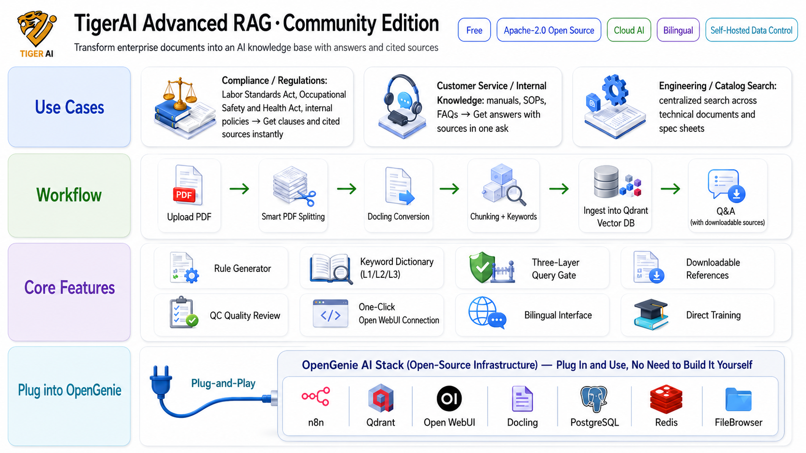

# TigerAI Advanced RAG Community

**Turn your documents into a cited, ask-anything knowledge base.**
An open-source RAG platform — and the **reference application** for the
[OpenGenie AI Stack](https://github.com/TigerAI-Taiwan/OpenGenie-AI-Stack).

[-1a7f37)](#editions)

[Quick Start](#quick-start) · [Agent install guide](AGENTS.md) · [Runbook](INSTALL.md) · [OpenGenie Stack](https://github.com/TigerAI-Taiwan/OpenGenie-AI-Stack)

**English** ｜ [繁體中文](#中文)

---

Upload PDFs → split → convert (Docling) → chunk + metadata/keywords → ingest to Qdrant → chat through Open WebUI, with **downloadable source citations** in every answer. Web UI, **fully bilingual (EN / 中文)**, **no code required**.

## How it fits with the OpenGenie AI Stack

This app is the **application layer**; the [OpenGenie AI Stack](https://github.com/TigerAI-Taiwan/OpenGenie-AI-Stack) is the **infrastructure** underneath (n8n · Qdrant · Open WebUI · Docling · PostgreSQL · Redis · FileBrowser). Deploy OpenGenie first, then plug this in — see the **Connect to OpenGenie** panel in the overview above. TigerAI RAG Community shows how the stack becomes a real, working product.

## What you can do

- **Build knowledge bases** from PDFs: server-side split → Docling Markdown → JSON chunking → metadata + L1/L2/L3 keyword dictionary → Qdrant ingest
- **Rule Builder** — generate a domain system-prompt from sample documents (A/B/C → pick or synthesize)
- **Chat verification & QC** — coverage check (source ↔ vector DB) and dual-AI answer audit
- **Cloud chat apps** — wire an Open WebUI app to an n8n query webhook in two clicks
- **Citations with download links** — every answer lists the source files used, each downloadable
- **Bilingual UI** — toggle EN / 中文 anytime

## Quick Start

**Hand it to your AI coding agent — no manual setup.**

Open **Claude Code / Antigravity / Codex** and give it **two URLs**:

1. https://github.com/TigerAI-Taiwan/OpenGenie-AI-Stack — the infrastructure
2. **this repo** — the application

The agent reads both and **installs + wires them end-to-end**. The only thing it asks you for is a **Cloud AI API key** (any OpenAI-compatible endpoint).

> 📖 The agent follows **[AGENTS.md](AGENTS.md)** (entry) and **[INSTALL.md](INSTALL.md)** (the step-by-step runbook). Images are published multi-arch (**amd64 + arm64**, incl. NVIDIA Grace/GB10) at `ghcr.io/tigerai-taiwan/tigerai-rag-{nginx,backend,splitter}`.

Prefer to drive it yourself? Follow **[INSTALL.md](INSTALL.md)** — discover the OpenGenie stack → `docker compose up` → import n8n workflows → install the Open WebUI pipes → set your Cloud AI key.

> **Env vars worth knowing** (full list in `.env.example`, see also [INSTALL.md](INSTALL.md) §2):
> - `TIGERAI_EDITION=community` — edition tag (do not change; Pro/Enterprise images use their own value).
> - `N8N_HOST=n8n-main` — canonical OpenGenie main n8n container name (override if your stack uses a different name).
> - `SETTINGS_SECRET` / `TRANSIT_SECRET` — **MUST** be set to strong random strings in production (`openssl rand -hex 32`); leaving them blank works for local dev only — backend will auto-generate per-restart values that break multi-instance and persist nothing.
> - `PG_PASSWORD` / `FB_PASSWORD` — defaults are for local dev only; **change in production** (FileBrowser enforces ≥12 chars).

## 📚 安裝 AI 必讀文件 (Install AI: read these, in order)

如果你是被指派來安裝這個專案的 AI agent(Claude Code / Antigravity / Gemini / Codex…),**按以下順序讀這些文件**,不要只看 README 就動手:

| # | 文件 | 為什麼要讀 | 一句話重點 |
|---|---|---|---|
| 1 | **[AGENTS.md](AGENTS.md)** | 安裝入口、兩階段 check-first 流程 | 先 `--check-only` dry-run 再實裝;只跟人要「無法用 API 拿到的密鑰」 |
| 2 | **[STACK-REFERENCE.md](STACK-REFERENCE.md)** §4 | **強制 probe SOP** | ⚠️ **絕不可套預設值寫 .env** — 每台 OpenGenie 部署的 container 名 / network / 帳密都不同,必須 `docker ps` + `docker network inspect` 拿真實值 |
| 3 | **[INSTALL.md](INSTALL.md)** | 逐步 runbook | RAG/ 目錄自動處理、allowed_formats、port 衝突等細節 |
| 4 | **[LESSONS_LEARNED.md](LESSONS_LEARNED.md)** | 踩過的坑 + 修法 | fresh install 必中的 bug 全記在這(v1.0.10-25),含 n8n API key 必須含 `credentials:read`、Cloud AI 別用 reasoning model 等 |
| 5 | **[.env.example](.env.example)** | 設定欄位參考 | 每個 env 的用途 + 哪些是必填 / 哪些有安全警告 |

**最容易踩的 3 個雷(全寫在上面文件裡,這裡先警告):**
1. **不要套 STACK-REFERENCE 的預設容器名** — 你的機器可能是 `open-webui`(非 `openwebui-main`)、`docling-serve`(非 `docling`)、某些 service 不在同一個 network。必須 probe。
2. **n8n API key 必須含 `credentials:read` 權限** — 否則 OpenAI 憑證綁不上、workflow 無法 active(deploy 會 fail-stop 提醒你)。
3. **Cloud AI model 用 `gpt-4o-mini` 類標準模型** — 別用 `o1` / `gpt-5.x` reasoning model(參數限制如不接 `temperature` / `max_tokens` 會讓訓練 chain 失敗)。

## Editions

| | **Community** (this repo) | **Business** |
|---|---|---|
| AI | **Cloud** (any OpenAI-compatible endpoint) | **+ On-premise / local** (Ollama, llama.cpp, vLLM) |
| Retrieval | Vector + metadata filtering | **+ Reranking, multimodal catalog RAG, trustworthy QC** |
| Cross-document | Per-document Q&A (vector) | **+ Knowledge graph (cross-report, multi-hop relations)** |
| Training | Direct training | **+ Scheduling queue** |
| Price | Free, Apache-2.0 | Commercial |

> Need **local / on-prem AI, reranking, multimodal catalog RAG, or a cross-document knowledge graph**? Those are **TigerAI Advanced RAG Business** features — [get in touch](https://github.com/TigerAI-Taiwan).

## License

[Apache-2.0](LICENSE) — code is yours to use, fork, modify and redistribute freely.

### Trademark

**TigerAI**, the TigerAI logo, and product names such as *TigerAI Advanced RAG*, *TigerAI Advanced RAG Community*, and *TigerAI Advanced RAG Business* are trademarks of **TigerAI Taiwan**. The Apache-2.0 license covers the **source code only** — it does not grant rights to the name or logo.

You can fork and build on this codebase freely; please rebrand if you redistribute a modified version commercially or host it as a paid service. See **[TRADEMARK.md](TRADEMARK.md)** for the full policy (it's short and friendly — same model as Kubernetes / Docker / Grafana / PostgreSQL).

---

## 繁體中文

開源、網頁式的 **RAG 知識庫建置平台**,同時是 **[OpenGenie AI Stack](https://github.com/TigerAI-Taiwan/OpenGenie-AI-Stack) 的官方範例應用** —— 示範如何把這套自架 AI 基礎設施變成一個真正可用的產品。

上傳 PDF → 切檔 → Docling 轉檔 → 切塊 + metadata/關鍵字 → 灌入 Qdrant → 透過 Open WebUI 問答,**每個答案都附可下載的原始檔出處**。全程網頁操作、**中英雙語**、**免寫程式**。

**與 OpenGenie 的關係**:OpenGenie 提供引擎(n8n / Qdrant / Open WebUI / Docling / PostgreSQL / Redis / FileBrowser);本專案是跑在上面的**應用層**,完整示範這套 stack 怎麼被運用。

**安裝(免動手)**:打開 AI coding agent(**Claude Code / Antigravity / Codex**),把**兩個 URL** 丟給它 —— ① [OpenGenie AI Stack](https://github.com/TigerAI-Taiwan/OpenGenie-AI-Stack)(基礎設施)② 本 repo(應用)。Agent 會自己讀完、**安裝並串接好**,人不用介入;只會跟你要一把 **Cloud AI API key**。詳見 **[AGENTS.md](AGENTS.md)** / **[INSTALL.md](INSTALL.md)**。映像檔為 multi-arch(**amd64 + arm64**,含 NVIDIA Grace/GB10),位於 `ghcr.io/tigerai-taiwan/tigerai-rag-*`。

**版本差異**:Community(本 repo,免費、Apache-2.0、**雲端 AI**)= 陽春雲端版;**地端/on-prem、Rerank 重排、多模態型錄 RAG、可信 QC、排程佇列、跨文件知識圖譜(跨報告多跳交叉查詢)** 屬付費版 —— 需要請洽詢。

**商標(Trademark)**:**TigerAI**、TigerAI logo 與「TigerAI Advanced RAG」等產品名稱為 **TigerAI Taiwan** 的商標。Apache-2.0 只授權**程式碼**,不授權品牌與 logo。可以自由 fork / 修改 / 使用程式碼;但若你**修改後對外散佈或商業化(如 SaaS 服務)**,請改用自己的名稱與 logo(如「MyCompany RAG (fork of TigerAI)」這樣標示來源 OK)。完整政策見 **[TRADEMARK.md](TRADEMARK.md)**(與 Kubernetes / Docker / Grafana / PostgreSQL 同模式)。
